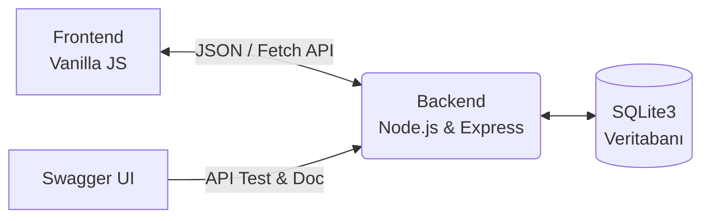

# 🚀 Kariyer ve Mülakat Takip Sistemi


## 📖 Proje Hakkında
Bu proje, Sistem Analizi ve Tasarımı dersi kapsamında geliştirilmiş tam yığın (full-stack) bir web uygulamasıdır. Öğrenci iş ve staj başvurularının takip edilmesi, mülakat süreçlerinin yönetilmesi ve başarı oranlarının analiz edilmesi amacıyla, yazılım mühendisliği prensiplerine sadık kalınarak tasarlanmıştır.

## ⚙️ Sistem Mimarisi

Sistem, RESTful prensiplerine uygun olarak asenkron (SPA) yapıda tasarlanmıştır:



## 📂 Proje Yapısı
```
📦 Kariyer-Takip-Sistemi
 ┣ 📂 backend
 ┃ ┣ 📂 controllers     # İş mantığını yönlendiren denetleyiciler
 ┃ ┣ 📂 middlewares     # JWT Kimlik doğrulama vb. ara katmanlar
 ┃ ┣ 📂 models          # Veritabanı tabloları ve sorguları
 ┃ ┣ 📂 routes          # REST API uç noktaları
 ┃ ┣ 📂 services        # Çekirdek iş mantığı (Business Logic)
 ┃ ┣ 📜 server.js       # Sunucu başlangıç dosyası
 ┃ ┗ 📜 swagger.json    # API Dokümantasyon konfigürasyonu
 ┣ 📂 frontend
 ┃ ┣ 📜 index.html      # SPA Ana Arayüzü
 ┃ ┗ 📜 app.js          # İstemci tarafı dinamik işlemler
 ┣ 📂 tests             # Jest ile yazılmış Unit Testler
 ┗ 📜 README.md
```

## 🚀 Sistem Kurulumu ve Çalıştırılması
​Projeyi kendi bilgisayarınızda çalıştırmak için aşağıdaki adımları izleyin:
1. Proje dosyalarını bilgisayarınıza indirin ve klasör dizininde bir terminal açın.
2. Gerekli bağımlılıkları yüklemek için şu komutu çalıştırın:
 ```
npm install
```
3. Sunucuyu (Backend) ayağa kaldırmak için şu komutu çalıştırın:
```
node backend/server.js
```
4.Sunucu http://localhost:3000 adresinde çalışmaya başlayacaktır. Veritabanı (kariyertakip.db) otomatik olarak oluşturulacaktır
5.Frontend arayüzünü görmek için frontend/index.html dosyasını tarayıcınızda açın (veya VS Code Live Server ile başlatın).
## 🔌 API Kullanımı ve Swagger

​Sistem tam CRUD (Oluşturma, Okuma, Güncelleme, Silme) işlemlerini destekleyen RESTful uç noktalara sahiptir. API endpoint'lerini keşfetmek ve test etmek için sunucu çalışırken şu adrese gidin:

​Swagger UI: http://localhost:3000/api-docs


## ​🧪 Birim Testleri (Unit Tests)
​İş mantığı (business logic) route'lardan bağımsız ayrı bir katmanda (services/) yazılmış olup Jest kütüphanesi ile test edilmiştir. Testleri çalıştırmak için terminalde şu komutu girin:

```
npm test
```
